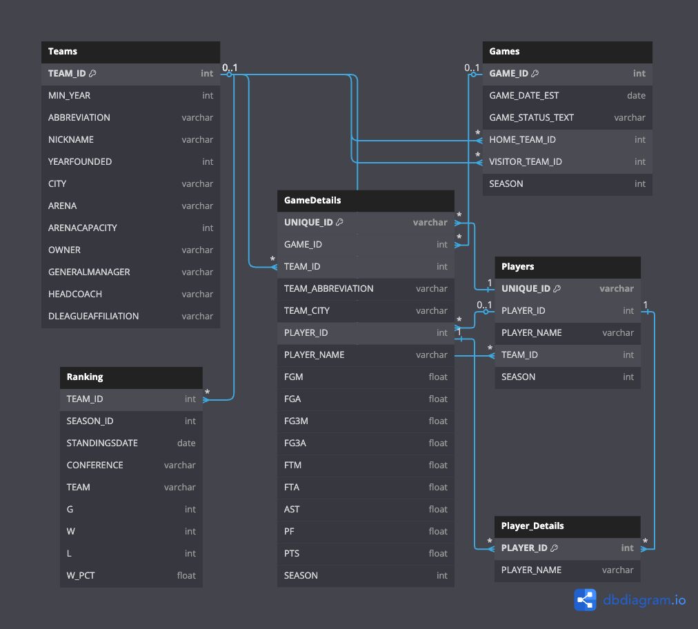

# 🏀 Baller Base – NBA Relational Database & Web Portal

A fully normalized, query-optimized relational database system for analyzing NBA game statistics (2003–2022). Built as a final project for the **CSE587: Data Models and Query Languages** course.

---

## 📌 Objective

The goal of **Baller Base** is to move beyond spreadsheets and build a robust, scalable **PostgreSQL database** that enables efficient **storage, retrieval, and analysis** of NBA data — including player performance, team stats, game outcomes, and league rankings.

Use cases:
- 🧠 NBA Analysts & Coaches: KPI dashboards & team strategy
- 🏀 Fans & Stat Enthusiasts: Compare players across seasons
- 🧮 Developers: Learn schema design, normalization & Flask UI

---

## 🧱 Schema Design & Normalization

The database is constructed with **6 core tables**, designed using **BCNF/3NF normalization principles**, and validated using **functional dependencies**.

| Table           | Description                                      | Normal Form |
|----------------|--------------------------------------------------|-------------|
| `Teams`         | Team info, city, arena, owner                   | ✅ BCNF     |
| `Players`       | Player ID, team, season                         | ✅ 3NF (w/ Unique ID) |
| `PlayerDetails` | Unique mapping of Player ID to Player Name      | ✅ BCNF     |
| `Games`         | Game metadata: home/away, score, date, status   | ✅ BCNF     |
| `GameDetails`   | Player game stats (PTS, AST, FG3M, etc.)        | ✅ 3NF      |
| `Ranking`       | Standings per season (W/L, conference, % wins)  | ✅ 3NF      |

---

## 🧹 Data Cleaning & Challenges Solved

🛠 Key preprocessing fixes:
- Created a **`UNIQUE_ID`** combining `Player_ID + Team_ID + Season` to handle duplicates
- Fixed inconsistent name formats (e.g., "OJ Mayo" vs "O.J. Mayo")
- Enforced referential integrity by resolving duplicate or missing foreign keys
- Resolved PostgreSQL datatype issues (e.g., `YEAR` to `INT`)
- Added constraints: `NOT NULL`, range checks (`0 <= W_PCT <= 1`), valid foreign key mapping

---

## ⚙️ Tech Stack

| Layer     | Technology             |
|-----------|------------------------|
| Database  | PostgreSQL (via pgAdmin) |
| Backend   | Python Flask           |
| Frontend  | HTML5 + Bootstrap 5    |
| Hosting   | Localhost Flask App    |
| Dataset   | Kaggle NBA Stats (2003–2022) |

---

## 🌐 Web App UI

An interactive web portal to:
- 🧮 Run ad hoc SQL queries
- 📥 Insert records into 6 tables
- 📊 Execute 5+ predefined KPI queries

> Example screenshot:  
> 

---

## 💡 Key Features

- ✅ Fully normalized database (BCNF/3NF)
- 🚀 PostgreSQL indexing for speed (↓ from 31ms → 1ms)
- 🔎 Predefined KPIs available from dropdown
- 🧪 `EXPLAIN ANALYZE` used to optimize real queries
- 📈 Supports 668,000+ game records and 200K+ rankings

---

## ⚡ Indexing & Query Optimization

```sql
-- Indexing to improve join & filter speed
CREATE INDEX idx_games_details_player_id ON gamedetails(player_id);
CREATE INDEX idx_games_details_game_id ON gamedetails(game_id);
CREATE INDEX idx_ranking_team_id ON ranking(team_id);
CREATE INDEX idx_players_player_id ON players(player_id);


---

## 🧪 Sample SQL Queries

### 1. ➕ Insert: New NBA team (Buffalo Bills)

```sql
INSERT INTO teams (
  team_id, min_year, abbreviation, nickname,
  yearfounded, city, arena, arenacapacity,
  owner, generalmanager, headcoach, dleagueaffiliation
) VALUES (
  1610612770, 1995, 'BNY', 'Bills', 2025, 'Buffalo',
  'Bills Arena', 10000, 'Jeffrey Gundlach', 'Tom Brady',
  'Josh Allen', 'Buffalo Bills'
);
```

### 2. 🔄 Update: Elon Musk buys the team

```sql
UPDATE teams
SET owner = 'Elon Musk'
WHERE team_id = 1610612770;
```

### 3. ❌ Delete: Remove Buffalo team

```sql
DELETE FROM teams
WHERE abbreviation = 'BNY';
```

### 4. 🔝 Players with >30 PTS in a game

```sql
SELECT gd.player_id, pd.player_name, t.nickname, gd.pts
FROM gamedetails gd
JOIN playerdetails pd ON gd.player_id = pd.player_id
JOIN teams t ON gd.team_id = t.team_id
WHERE gd.pts > 30;
```

### 5. 🎯 Stephen Curry 3PT Avg per Season

```sql
SELECT gd.season, t.nickname, ROUND(AVG(gd.fg3m), 2) AS avg_3ptrs
FROM gamedetails gd
JOIN playerdetails pd ON gd.player_id = pd.player_id
JOIN teams t ON gd.team_id = t.team_id
WHERE pd.player_name = 'Stephen Curry'
GROUP BY gd.season, t.nickname
ORDER BY gd.season;
```

---

## 🧠 Advanced Query Examples

### 🥇 Most Home Wins per Season

```sql
SELECT g.season, g.home_team_id, t.nickname, COUNT(*) as home_wins
FROM games g
JOIN teams t ON g.home_team_id = t.team_id
WHERE g.home_team_wins = TRUE
GROUP BY g.season, g.home_team_id, t.nickname
HAVING COUNT(*) = (
    SELECT MAX(wins)
    FROM (
        SELECT COUNT(*) AS wins
        FROM games
        WHERE home_team_wins = TRUE AND season = g.season
        GROUP BY home_team_id
    ) AS season_wins
)
ORDER BY g.season;
```

### 📈 Top 10 Players > 2017 Season Avg

```sql
SELECT pd.player_name, ROUND(AVG(gd.pts),2) AS player_avg,
       (SELECT ROUND(AVG(pts),2) FROM gamedetails WHERE season=2017) AS season_avg
FROM gamedetails gd
JOIN playerdetails pd ON gd.player_id = pd.player_id
WHERE gd.season = 2017
GROUP BY pd.player_name
HAVING AVG(gd.pts) > (SELECT AVG(pts) FROM gamedetails)
ORDER BY player_avg DESC
LIMIT 10;
```

---

## ▶️ Run the App Locally

### 🔧 Requirements

* Python 3.x
* PostgreSQL (with dataset imported)
* Flask

### 📦 Install Dependencies

```bash
pip install flask psycopg2-binary
```

### ▶️ Launch Web App

```bash
python app.py
```

Then open your browser at:

```
http://localhost:5000/
```

---

## 📌 ER Diagram

The schema connects all six tables via primary/foreign keys and avoids redundancy while supporting flexible queries.



---

## 📂 Dataset Source

🏀 [NBA Stats Kaggle Dataset (2003–2022)](https://www.kaggle.com/datasets)

---

